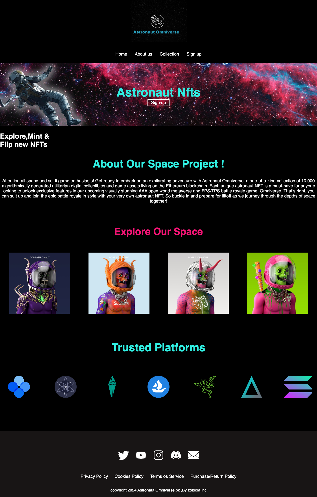
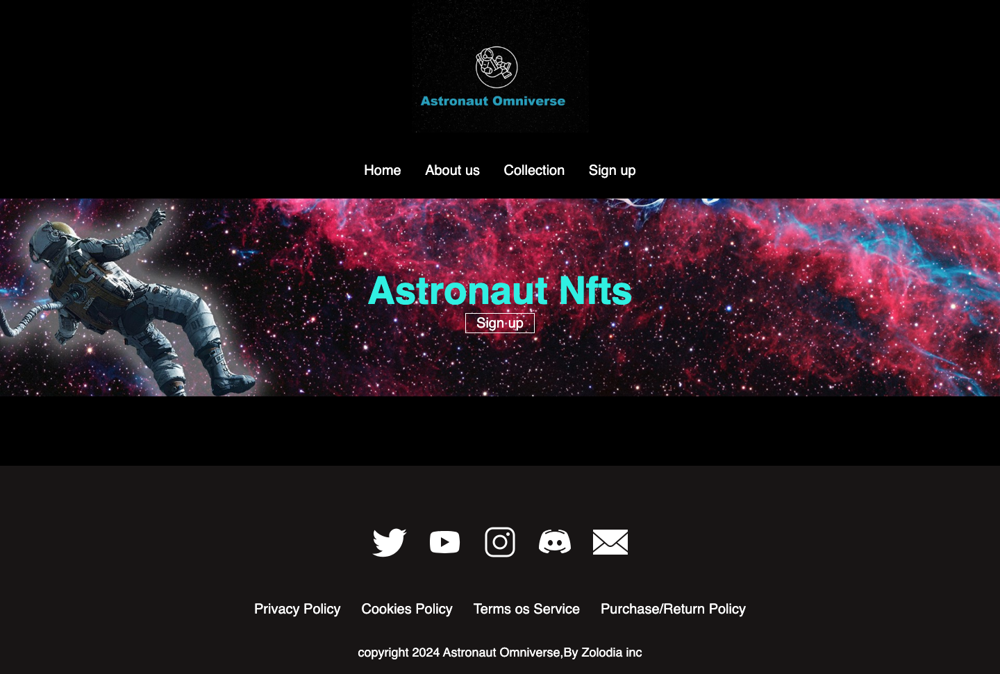
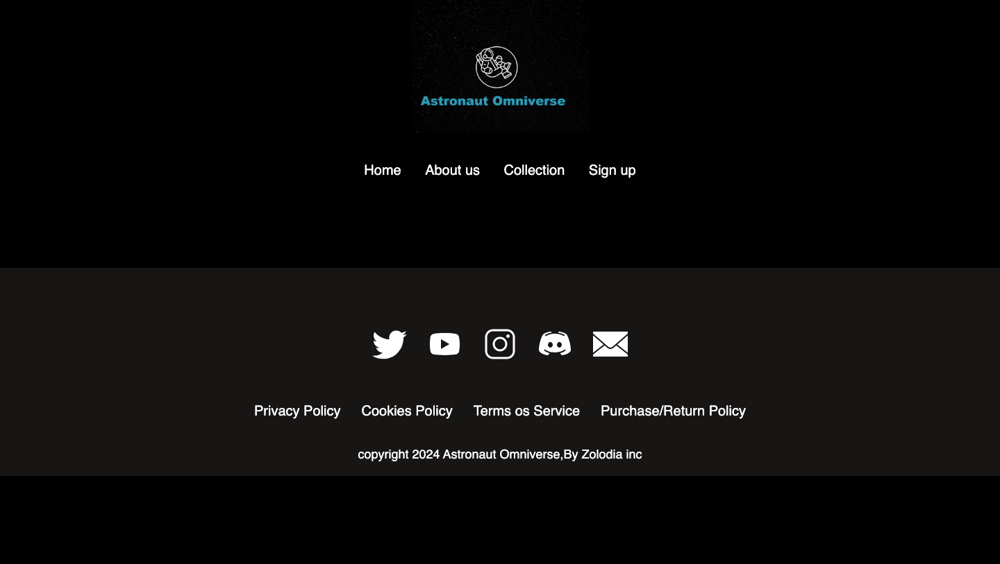

# 🚀 Astronaut Omniverse


### 🔗 [Live Demo](https://xaviercop.github.io/astronaut-omniverse/)

## Description

**Astronaut Omniverse** is a space/NFT-themed, front-end landing page design for a fictional astronaut NFT collection. It's a responsive multi-page static site built with plain HTML and CSS — a design/marketing concept, not a working product.

> **Note:** This is a **front-end landing page design only**. There is **no backend, no wallet integration, and no blockchain/Web3 functionality** behind it — the NFT/Ethereum theme is presentation and marketing copy. It's an early-stage build: the home page is the most complete, while the About and Sign-up pages are intentionally minimal placeholders.

## Screenshots

### Home


### Collections


### About


### Sign up


## Features

- 🌌 **Space/NFT-themed dark design** — black canvas with cyan (`#30efe2`) and magenta (`#f51475`) accents
- 📱 **Responsive layout** — adapts from desktop to mobile
- 🍔 **Mobile hamburger menu** — slide-in navigation powered by a small vanilla-JS toggle
- 🖼️ **Astronaut NFT gallery** — "Explore Our Space" showcase grid
- 🤝 **Trusted-platforms row** — logo wall (OpenSea, Solana, Cosmos, and more)
- 🔗 **Multi-page structure** — Home, Collections, About, and Sign-up pages with a shared header/footer

## Tech Stack

| Technology | Purpose |
|---|---|
| HTML5 | Markup and page structure |
| CSS3 | Styling, layout (flexbox), theming, responsive breakpoints |
| JavaScript (Vanilla) | Mobile menu show/hide toggle |
| Font Awesome 6 | Icons (loaded via CDN) |

## Project Structure

```
.
├── index.html          # Home / landing page (entry point)
├── collections.html    # Collections page
├── About us.html       # About page (early-stage placeholder)
├── sign up.html        # Sign-up page (early-stage placeholder)
├── css/
│   └── style.css       # All site styling
├── images/             # Logos, astronaut art, platform + social icons
└── screenshots/        # Screenshots used in this README
```

## Running Locally

No build tools or install required:

1. Clone or download this repository.
2. Open `index.html` in any modern web browser.

That's it.

## Project Status

This is an early-stage / learning front-end project. The home page is largely complete; the Collections, About, and Sign-up pages are in-progress placeholders that share the site's header and footer. Navigation between all pages works and nothing 404s.

## License

Released under the [MIT License](./LICENSE).
